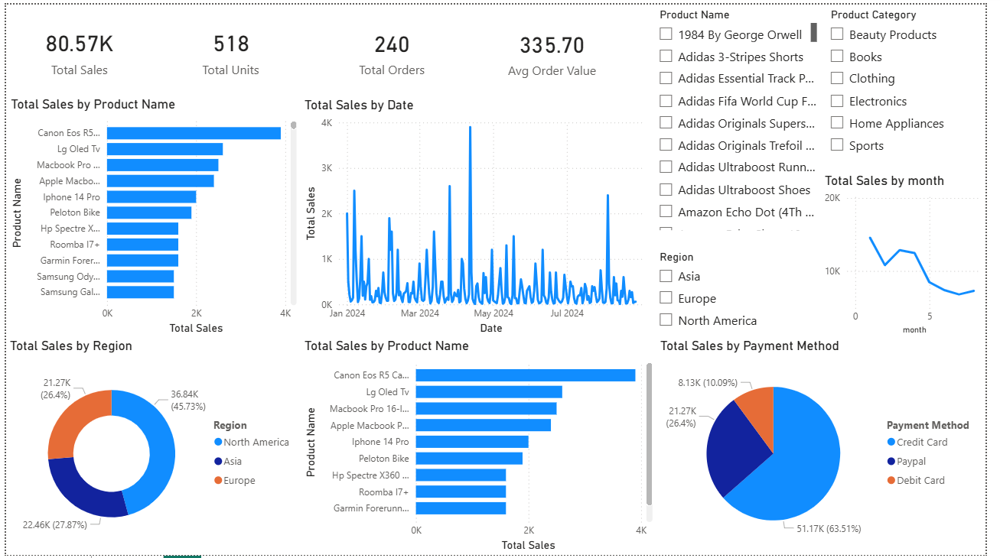

📊 Online Sales Dashboard – Power BI Project
🔹 Project Overview
This project presents an interactive Power BI dashboard built using an online sales dataset. The dashboard analyzes sales performance, product trends, and regional contributions to help understand business performance and support data-driven decision-making.

The goal of this project is to demonstrate data analysis, visualization, and storytelling skills using Power BI.

🔹 Objectives
Analyze overall sales performance
Identify top-performing products and categories
Understand regional sales distribution
Track sales trends over time
Enable interactive data exploration

🔹 Tools & Technologies Used
Power BI – Dashboard development
DAX (Data Analysis Expressions) – Calculated measures
Power Query – Data cleaning and transformation
GitHub – Project hosting

🔹 Dataset Information
The dataset contains online sales transactions with the following fields:
Transaction ID
Date (Year, Month, Day)
Product Category
Product Name
Units Sold
Unit Price
Total Revenue
Region
Payment Method

🔹 Key Features of Dashboard
✔ KPI Cards (Total Revenue, Total Units Sold, Average Order Value)
✔ Top 10 Products by Revenue
✔ Sales by Category & Region
✔ Sales Trend Over Time (Line Chart)
✔ Interactive Slicers (Date, Region, Category)
✔ Reset Filter Button
✔ Clean and user-friendly layout

🔹 DAX Measures Created
Examples:
Total Revenue
Total Revenue = SUM('Cleaned_Online_Sales'[Total Revenue])

Total Units Sold
Total Units Sold = SUM('Cleaned_Online_Sales'[Units Sold])

Average Order Value
Avg Order Value = DIVIDE([Total Revenue], DISTINCTCOUNT('Cleaned_Online_Sales'[Transaction ID]))

🔹 Key Insights
Certain product categories contribute the majority of revenue
Some regions consistently outperform others
Sales show noticeable trends across months
Digital payment methods are widely used

🔹 Business Value
This dashboard helps:
Monitor sales performance
Identify high-performing products
Understand customer purchasing patterns
Support strategic decision-making

🔹How to Use
Download the .pbix file
Open in Power BI Desktop
Use slicers to filter data dynamically

🔹 Project Files
Power BI Dashboard (.pbix)
Dataset (.csv)
Sales analysis(i
README documentation

🔹 Author
Prince Shakya
Aspiring Data Analyst | Power BI Enthusiast

⭐ If you like this project
Feel free to star ⭐ the repository or connect with me on LinkedIn!

